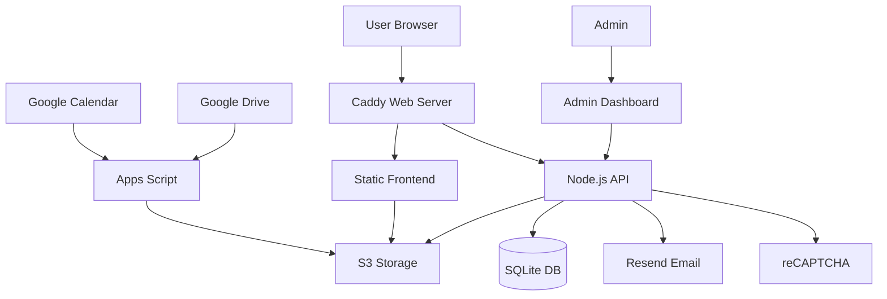

# MTÜ Kaiu Kodukant Website

A modern, high-performance community website for MTÜ Kaiu Kodukant (Kaiu Community Association) featuring event management, photo galleries, and membership services.


## 🌟 Overview

This is a comprehensive community management platform built for MTÜ Kaiu Kodukant, featuring a static frontend for optimal performance and a Node.js API backend for dynamic functionality. The system integrates with Google services for content management and uses S3 storage for efficient content delivery.

### Live Site
🌐 **Production**: [https://kaiukodukant.ee](https://kaiukodukant.ee)

## 🎯 Key Features

### Community Features
- **📅 Event Calendar** - Synchronized from Google Calendar with automatic updates
- **🖼️ Photo Gallery** - Dynamic galleries with lightbox, powered by Google Drive
- **📝 Membership Registration** - Online form with email notifications
- **✉️ Contact Forms** - Direct communication with administrators
- **📱 Mobile Responsive** - Optimized for all devices and screen sizes
- **🌐 Estonian Language** - Fully localized interface

### Technical Features
- **⚡ High Performance** - Static frontend with CDN-cached content
- **🔒 Security** - reCAPTCHA protection, rate limiting, JWT authentication
- **📊 Admin Dashboard** - Manage submissions and monitor system status
- **🔄 Automated Sync** - Google Calendar and Drive content synchronized to S3
- **📧 Email Notifications** - Instant alerts via Resend API
- **🐳 Docker Deployment** - Containerized services for easy deployment
- **🔍 SEO Optimized** - Meta tags, structured data, sitemap
- **♿ Accessible** - WCAG compliant with proper ARIA labels

## 🏗️ Architecture



### Frontend Stack
- **Framework**: Vanilla HTML5, CSS3, JavaScript
- **Styling**: Tailwind CSS (compiled via CLI) + Custom CSS
- **Calendar**: FullCalendar.js
- **Gallery**: Custom lightbox implementation
- **Forms**: Native HTML5 validation + JavaScript

### Backend Stack
- **Runtime**: Node.js 20 LTS
- **Framework**: Express.js
- **Database**: SQLite (persistent volume)
- **Authentication**: JWT tokens
- **Email**: Resend API
- **File Storage**: S3-compatible (Pilvio)

### Infrastructure
- **Web Server**: Caddy (automatic HTTPS)
- **Containers**: Docker & Docker Compose
- **SSL**: Let's Encrypt certificates
- **CDN**: S3 for static assets
- **Monitoring**: Health checks and status dashboard

### Content Sync Pipeline
- **Google Apps Script** runs on schedule (every 5-10 minutes)
- **Calendar Sync**: Google Calendar → S3 JSON files
- **Gallery Sync**: Google Drive folders → S3 images + metadata
- **Version Control**: Timestamps in version.json for cache busting

## 📁 Project Structure

```
kaiumtu/
├── 📄 HTML Pages (Root)
│   ├── index.html              # Homepage
│   ├── events.html             # Events calendar
│   ├── gallery.html            # Photo gallery
│   ├── about.html              # About us
│   ├── contact.html            # Contact form
│   └── membership.html         # Membership registration
│
├── 🎨 Frontend Assets
│   ├── css/
│   │   ├── styles.css          # Custom styles (legacy)
│   │   └── output.css          # Compiled Tailwind (generated)
│   ├── src/
│   │   └── input.css           # Tailwind source + custom styles
│   ├── js/
│   │   ├── config.js           # Central configuration
│   │   ├── common.js           # Shared functionality
│   │   ├── calendar.js         # Calendar integration
│   │   ├── gallery.js          # Gallery & lightbox
│   │   └── forms.js            # Form handling
│   ├── components/
│   │   └── footer.html         # Reusable footer
│   └── tailwind.config.js      # Tailwind configuration
│
├── 🔧 Backend API
│   ├── api/
│   │   ├── server.js           # Express server
│   │   ├── config/             # Configuration
│   │   ├── routes/             # API endpoints
│   │   │   ├── admin.js        # Admin routes
│   │   │   ├── forms.js        # Form submission
│   │   │   └── monitoring.js   # System monitoring
│   │   ├── services/           # Business logic
│   │   │   ├── database.js     # SQLite operations
│   │   │   ├── email.js        # Resend integration
│   │   │   ├── s3-client.js    # S3 operations
│   │   │   └── syncHistory.js  # Sync monitoring
│   │   ├── middleware/         # Express middleware
│   │   │   ├── auth.js         # JWT authentication
│   │   │   └── rate-limit.js   # Rate limiting
│   │   └── views/              # Admin dashboard HTML
│   │       ├── admin/          # Dashboard pages
│   │       └── assets/         # Dashboard assets
│
├── ☁️ Google Apps Script
│   ├── apps-script/
│   │   ├── calendar-sync.gs         # Calendar → S3 sync
│   │   ├── gallery-sync-incremental.gs # Gallery → S3 sync
│   │   ├── drive-change-trigger.gs   # Change detection
│   │   ├── s3-utils.gs              # S3 upload utilities
│   │   ├── config.gs                # Script configuration
│   │   └── triggers-setup.gs        # Automated triggers
│
├── 🐳 Docker Configuration
│   ├── docker/
│   │   ├── docker-compose.yml       # Service orchestration
│   │   ├── Dockerfile               # Web service (Caddy)
│   │   ├── api/Dockerfile           # API service
│   │   ├── Caddyfile.prod          # Production config
│   │   ├── deploy.sh                # Deployment script
│   │   └── .env.example             # Environment template
│
├── 📚 Documentation
│   ├── README.md                    # This file
│   ├── CLAUDE.md                    # AI assistant context
│   ├── DEPLOY.md                    # Deployment guide
│   ├── SETUP.md                     # Initial setup guide
│   └── planning/                    # Architecture docs
│
└── 🧪 Testing
    ├── test-calendar.html           # Calendar testing
    └── test-gallery.html            # Gallery testing
```

## 🚀 Getting Started

### Prerequisites

- **Docker** & **Docker Compose** (for deployment)
- **Domain name** with DNS configured
- **Resend account** for email notifications
- **reCAPTCHA v3 keys** for form protection
- **S3-compatible storage** (we use Pilvio)
- **Google account** for Calendar and Drive (optional)

### Quick Start (Development)

```bash
# Clone the repository
git clone https://github.com/kkiisler/kaiu-kodukant-website.git
cd kaiu-kodukant-website

# Install dependencies and build CSS
npm install
npm run build:css

# Or use watch mode for development
npm run watch:css

# Serve frontend locally (choose one)
python3 -m http.server 8080        # Python
npx serve                           # Node.js
php -S localhost:8080               # PHP

# Visit http://localhost:8080
```

### CSS Build Commands

```bash
npm run build:css   # Build minified CSS for production
npm run watch:css   # Watch and rebuild CSS on changes
```

### Production Deployment

```bash
# SSH to production server
ssh kkiisler@kaiukodukant.ee

# Navigate to project
cd kaiu-kodukant-website

# Pull latest changes
git pull origin main

# Deploy with Docker
cd docker
./deploy.sh
```

See [DEPLOY.md](DEPLOY.md) for detailed deployment instructions.

## ⚙️ Configuration

### Environment Variables (.env)

```bash
# Domain Configuration
DOMAIN_NAME=kaiukodukant.ee

# Database
DATABASE_PATH=/data/forms.db

# Email (Resend)
RESEND_API_KEY=re_xxxxxxxxxxxxx
RESEND_FROM_EMAIL=noreply@kaiukodukant.ee
INFO_EMAIL=info@kaiukodukant.ee

# Authentication
ADMIN_PASSWORD_HASH=$2b$10$xxxxxxxxxxxxx
JWT_SECRET=your-secret-key

# reCAPTCHA
RECAPTCHA_SECRET_KEY=6Lexxxxxxxxxxxxx

# S3 Storage (Pilvio)
S3_ENDPOINT=https://s3.pilw.io
S3_BUCKET=kaiugalerii
S3_ACCESS_KEY_ID=xxxxxxxxxxxxx
S3_SECRET_ACCESS_KEY=xxxxxxxxxxxxx
S3_REGION=eu-west-1

# Optional: Google Sheets Integration
GOOGLE_SHEETS_ENABLED=false
MEMBERSHIP_SPREADSHEET_ID=xxxxxxxxxxxxx
CONTACT_SPREADSHEET_ID=xxxxxxxxxxxxx
GOOGLE_SERVICE_ACCOUNT={"type":"service_account"...}
```

### Google Apps Script Configuration

1. Open [Google Apps Script](https://script.google.com)
2. Create new project
3. Copy files from `apps-script/` folder
4. Configure Script Properties:
   - `CALENDAR_ID`: Your Google Calendar ID
   - `GALLERY_FOLDER_ID`: Google Drive folder ID
   - `S3_ENDPOINT`, `S3_BUCKET`, `S3_ACCESS_KEY_ID`, `S3_SECRET_ACCESS_KEY`
5. Set up triggers:
   - `syncCalendar`: Every 5 minutes
   - `checkForGalleryChanges`: Every 10 minutes

## 📊 Monitoring & Administration

### Admin Dashboard
- **URL**: `https://api.kaiukodukant.ee/admin`
- **Features**: View form submissions, export data, monitor system
- **Login**: Use password configured in `.env`

### Monitoring Dashboard
- **URL**: `https://api.kaiukodukant.ee/admin/monitoring-enhanced`
- **Features**: S3 sync status, calendar/gallery updates, sync history
- **Metrics**: Success rate, sync frequency, error tracking

### Health Checks
- **API Health**: `https://api.kaiukodukant.ee/health`
- **Container Status**: `docker ps`
- **Logs**: `docker compose logs -f`

## 🔧 Development Workflow

1. **Make changes locally** in this repository
2. **Test functionality** thoroughly
3. **Verify implementation** meets requirements
4. **Write comprehensive commit messages**
5. **Push to GitHub**: `git push origin main`
6. **Deploy to production** via SSH when ready

### Commit Message Format
```
type: Brief description

- Detailed change 1
- Detailed change 2

Fixes #issue_number (if applicable)
```

Types: `feat`, `fix`, `docs`, `style`, `refactor`, `test`, `chore`

## 🛠️ Maintenance

### Regular Tasks
- **Monitor sync status** - Check monitoring dashboard daily
- **Review form submissions** - Check admin dashboard weekly
- **Update dependencies** - Docker images monthly
- **Backup database** - SQLite database weekly

### Backup Database
```bash
# On production server
docker exec kaiumtu-api sqlite3 /data/forms.db ".backup /data/backup.db"
docker cp kaiumtu-api:/data/backup.db ./backups/forms-$(date +%Y%m%d).db
```

### Update Docker Images
```bash
cd docker
docker compose pull
docker compose up -d
```

### Troubleshooting

| Issue | Solution |
|-------|----------|
| Forms not submitting | Check reCAPTCHA keys and API health |
| Calendar not updating | Verify Apps Script triggers and S3 credentials |
| Gallery images missing | Check Google Drive permissions and sync logs |
| Email not sending | Verify Resend API key and email configuration |
| Admin login fails | Check JWT_SECRET and password hash in .env |

## 📈 Performance

- **PageSpeed Score**: 95+ (mobile), 98+ (desktop)
- **First Contentful Paint**: < 1s
- **Time to Interactive**: < 2s
- **Lighthouse Score**: 95+ overall
- **CSS Bundle**: ~25KB minified (Tailwind CLI, only used classes)
- **JS Bundle**: < 100KB (excluding libraries)

## 🔒 Security

- **HTTPS everywhere** via Caddy automatic certificates
- **Content Security Policy** headers
- **Rate limiting** on all API endpoints
- **Input validation** and sanitization
- **SQL injection protection** via prepared statements
- **XSS protection** via proper escaping
- **CSRF protection** on forms
- **JWT authentication** for admin
- **bcrypt password hashing**
- **reCAPTCHA v3** on all forms

## 🤝 Contributing

1. Fork the repository
2. Create your feature branch (`git checkout -b feature/AmazingFeature`)
3. Make your changes
4. Test thoroughly
5. Commit your changes (`git commit -m 'feat: Add AmazingFeature'`)
6. Push to the branch (`git push origin feature/AmazingFeature`)
7. Open a Pull Request

## 📚 Documentation

- **[DEPLOY.md](DEPLOY.md)** - Complete deployment guide
- **[SETUP.md](SETUP.md)** - Initial setup instructions
- **[CLAUDE.md](CLAUDE.md)** - AI assistant context
- **[API Documentation](api/README.md)** - API endpoints reference
- **[Apps Script Guide](apps-script/README.md)** - Google Apps Script setup

## 📞 Support

For technical issues:
1. Check the [troubleshooting guide](#troubleshooting)
2. Review container logs: `docker compose logs -f`
3. Check monitoring dashboard for sync status
4. Verify environment configuration in `.env`

For community questions:
- Email: info@kaiukodukant.ee
- Website: https://kaiukodukant.ee/contact

## 🙏 Acknowledgments

- Built with ❤️ for the Kaiu community
- Powered by open-source technologies
- Special thanks to all contributors

## 📄 License

This project is proprietary software built for MTÜ Kaiu Kodukant. All rights reserved.

---

**MTÜ Kaiu Kodukant** - Bringing the community together online

*Initial launch: 2024 | API backend added: 2025*

[](https://kaiukodukant.ee)
[](https://api.kaiukodukant.ee/admin/monitoring-enhanced)