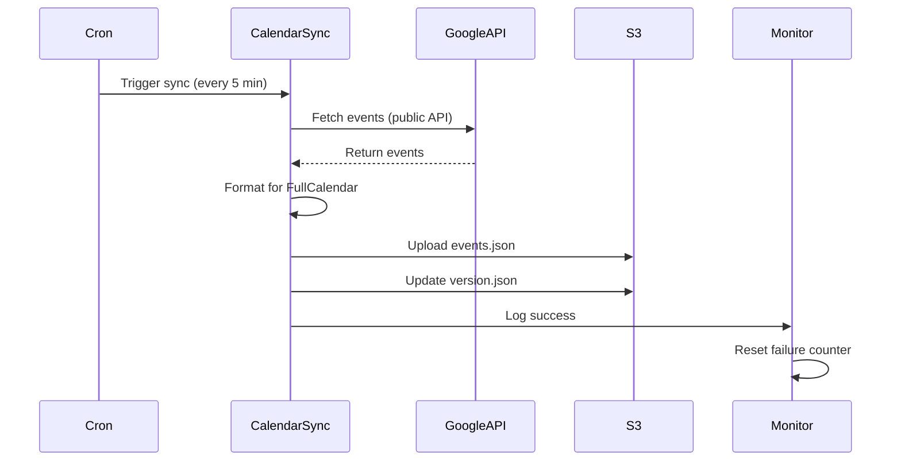
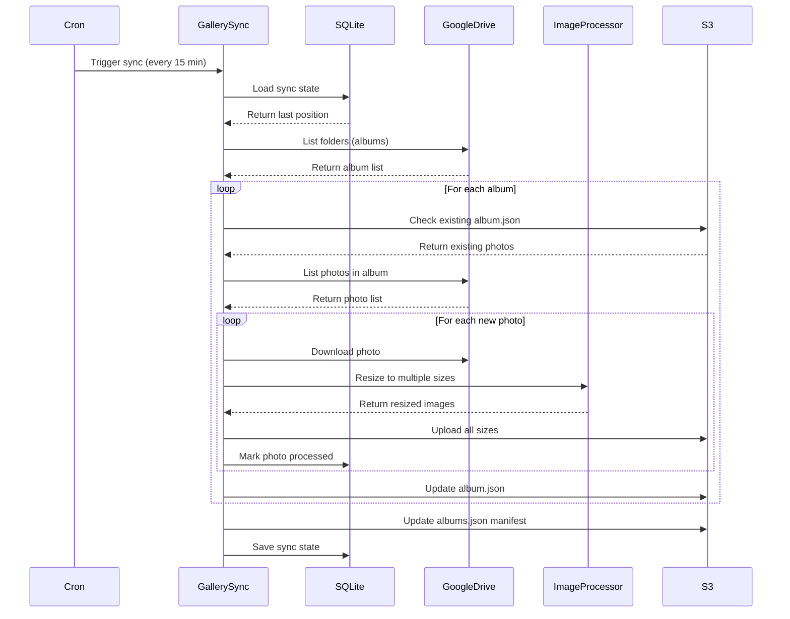

# Technical Architecture: Node.js Backend Sync Implementation

## System Architecture Overview

```
┌─────────────────┐     ┌─────────────────┐     ┌─────────────────┐
│  Google         │     │  Node.js        │     │  Pilvio S3      │
│  Services       │────▶│  Backend        │────▶│  Storage        │
│  (Public APIs)  │     │  (Sync Engine)  │     │  (kaiugalerii)  │
└─────────────────┘     └─────────────────┘     └─────────────────┘
        │                       │                         │
        │                       │                         │
        ▼                       ▼                         ▼
┌─────────────────┐     ┌─────────────────┐     ┌─────────────────┐
│  Google         │     │  SQLite DB      │     │  Static Website │
│  Calendar       │     │  (Sync State)   │     │  (Reads from S3)│
│  (Public)       │     └─────────────────┘     └─────────────────┘
└─────────────────┘
        │
        ▼
┌─────────────────┐
│  Google Drive   │
│  Gallery        │
│  (Public Folder)│
└─────────────────┘
```

## Component Details

### 1. Google Services Integration

#### Google Calendar API
- **Endpoint**: `https://www.googleapis.com/calendar/v3/calendars/{calendarId}/events`
- **Authentication**: None required (public calendar)
- **Calendar ID**: `a0b18dc4b7e4b9b40858746a7edddaa51b41014085ba2f4b2f89bf038ac13f12@group.calendar.google.com`
- **Rate Limits**: 1,000,000 queries/day for public calendars

#### Google Drive API
- **Endpoint**: `https://www.googleapis.com/drive/v3/files`
- **Authentication**: None required (public folder)
- **Folder ID**: `1t2olfDcjsRHFWovLbiOTRBFMYbZQdNdg`
- **Rate Limits**: 1,000,000 queries/day for public content

### 2. Node.js Backend Components

```
api/
├── services/
│   ├── sync/
│   │   ├── calendar-sync.js    # Calendar synchronization logic
│   │   ├── gallery-sync.js     # Gallery synchronization logic
│   │   ├── s3-client.js        # S3 operations wrapper
│   │   └── sync-state.js       # State management for incremental sync
│   ├── google/
│   │   ├── calendar-client.js  # Google Calendar API client
│   │   └── drive-client.js     # Google Drive API client
│   └── monitoring/
│       └── sync-monitor.js     # Monitoring and alerting
├── routes/
│   └── sync.js                 # Sync API endpoints
├── models/
│   └── sync-state.js           # SQLite schema for sync state
└── jobs/
    └── sync-scheduler.js       # Cron job definitions
```

### 3. Data Storage

#### S3 Structure
```
kaiugalerii/
├── calendar/
│   └── events.json             # Calendar events data
├── gallery/
│   ├── albums.json            # Gallery manifest
│   └── albums/
│       └── {albumId}.json     # Individual album data
├── images/
│   ├── {imageId}-300.jpg     # Thumbnail (300px)
│   ├── {imageId}-600.jpg     # Medium (600px)
│   ├── {imageId}-1200.jpg    # Large (1200px)
│   └── {imageId}-original.jpg # Original size
└── metadata/
    └── version.json           # Version tracking for cache busting
```

#### SQLite Schema
```sql
-- Sync state tracking
CREATE TABLE sync_state (
    id INTEGER PRIMARY KEY,
    component TEXT NOT NULL,        -- 'calendar' or 'gallery'
    last_sync TIMESTAMP,
    last_success TIMESTAMP,
    failure_count INTEGER DEFAULT 0,
    state_data TEXT,                -- JSON for component-specific state
    created_at TIMESTAMP DEFAULT CURRENT_TIMESTAMP,
    updated_at TIMESTAMP DEFAULT CURRENT_TIMESTAMP
);

-- Gallery sync progress
CREATE TABLE gallery_sync_progress (
    id INTEGER PRIMARY KEY,
    album_id TEXT NOT NULL,
    album_name TEXT,
    total_photos INTEGER,
    processed_photos INTEGER,
    status TEXT,                    -- 'pending', 'processing', 'complete'
    last_photo_id TEXT,
    created_at TIMESTAMP DEFAULT CURRENT_TIMESTAMP,
    updated_at TIMESTAMP DEFAULT CURRENT_TIMESTAMP
);

-- Processed photos tracking
CREATE TABLE processed_photos (
    id INTEGER PRIMARY KEY,
    photo_id TEXT UNIQUE NOT NULL,
    album_id TEXT NOT NULL,
    file_name TEXT,
    s3_keys TEXT,                   -- JSON array of S3 keys
    checksum TEXT,
    processed_at TIMESTAMP DEFAULT CURRENT_TIMESTAMP,
    INDEX idx_photo_id (photo_id),
    INDEX idx_album_id (album_id)
);
```

## Data Flow

### Calendar Sync Flow


### Gallery Sync Flow


## API Endpoints

### Public Endpoints (No Authentication)
```
GET /api/sync/status
    Response: {
        calendar: {
            lastSync: "2024-01-15T10:30:00Z",
            status: "healthy",
            eventCount: 42
        },
        gallery: {
            lastSync: "2024-01-15T10:25:00Z",
            status: "syncing",
            progress: "15/30 albums"
        }
    }
```

### Admin Endpoints (JWT Authentication)
```
POST /api/sync/calendar/trigger
    Manually trigger calendar sync

POST /api/sync/gallery/trigger
    Manually trigger gallery sync

GET /api/sync/logs
    Get recent sync logs

POST /api/sync/reset/{component}
    Reset sync state for component
```

## Environment Configuration

```env
# Google API Configuration
GOOGLE_CALENDAR_ID=a0b18dc4b7e4b9b40858746a7edddaa51b41014085ba2f4b2f89bf038ac13f12@group.calendar.google.com
GOOGLE_DRIVE_FOLDER_ID=1t2olfDcjsRHFWovLbiOTRBFMYbZQdNdg
GOOGLE_API_KEY=<optional_for_higher_quotas>

# S3 Configuration (reuse existing)
S3_ENDPOINT=https://s3.pilw.io
S3_BUCKET=kaiugalerii
S3_ACCESS_KEY_ID=<existing>
S3_SECRET_ACCESS_KEY=<existing>
S3_REGION=eu-west-1

# Sync Configuration
CALENDAR_SYNC_INTERVAL=5  # minutes
GALLERY_SYNC_INTERVAL=15  # minutes
CALENDAR_MONTHS_BACK=1
CALENDAR_MONTHS_FORWARD=6
GALLERY_BATCH_SIZE=10      # photos per batch
GALLERY_MAX_RUNTIME=300    # seconds

# Monitoring
SYNC_ALERT_EMAIL=kaur.kiisler@gmail.com
SYNC_FAILURE_THRESHOLD=3
```

## Error Handling Strategy

### Retry Logic
```javascript
// Exponential backoff with jitter
const retryWithBackoff = async (fn, maxRetries = 3) => {
    for (let i = 0; i < maxRetries; i++) {
        try {
            return await fn();
        } catch (error) {
            if (i === maxRetries - 1) throw error;

            const delay = Math.min(1000 * Math.pow(2, i) + Math.random() * 1000, 10000);
            await new Promise(resolve => setTimeout(resolve, delay));
        }
    }
};
```

### Failure Recovery
1. **Transient Failures**: Automatic retry with exponential backoff
2. **API Rate Limits**: Implement request throttling and queuing
3. **Network Issues**: Circuit breaker pattern with fallback to cached data
4. **Partial Sync Failure**: Resume from last successful position
5. **Complete Failure**: Alert admin and maintain last known good state

## Performance Optimizations

### Caching Strategy
- **Memory Cache**: Recent calendar events (5-minute TTL)
- **SQLite Cache**: Processed photo checksums
- **S3 Cache**: CDN caching for static content

### Parallel Processing
```javascript
// Process multiple albums in parallel
const PARALLEL_LIMIT = 3;
const albumBatches = chunk(albums, PARALLEL_LIMIT);
for (const batch of albumBatches) {
    await Promise.all(batch.map(album => processAlbum(album)));
}
```

### Incremental Sync
- Check S3 metadata before downloading
- Compare checksums to detect changes
- Skip unchanged content
- Track progress for resumability

## Monitoring & Observability

### Metrics to Track
- Sync duration (p50, p90, p99)
- Success/failure rates
- Data freshness
- API request counts
- S3 storage usage
- Error frequencies by type

### Logging Strategy
```javascript
// Structured logging
logger.info('Sync completed', {
    component: 'calendar',
    duration: 1234,
    eventCount: 42,
    bytesTransferred: 5678,
    timestamp: new Date().toISOString()
});
```

### Health Checks
```javascript
// Comprehensive health check
app.get('/health', async (req, res) => {
    const checks = await Promise.allSettled([
        checkGoogleAPI(),
        checkS3Access(),
        checkDatabase(),
        checkSyncFreshness()
    ]);

    const healthy = checks.every(c => c.status === 'fulfilled');
    res.status(healthy ? 200 : 503).json({
        status: healthy ? 'healthy' : 'degraded',
        checks: formatHealthChecks(checks)
    });
});
```

## Security Considerations

1. **API Keys**: Store securely in environment variables
2. **S3 Access**: Use IAM roles with minimal permissions
3. **Rate Limiting**: Implement per-IP rate limiting
4. **Input Validation**: Sanitize all external data
5. **Error Messages**: Don't expose sensitive information
6. **Audit Logging**: Track all sync operations

## Migration Rollback Plan

1. **Keep Apps Script code**: Don't delete immediately
2. **Parallel Run**: Run both systems for 1 week
3. **Quick Switch**: Environment variable to toggle sync source
4. **Data Backup**: Daily S3 snapshots during migration
5. **Monitoring**: Compare outputs between systems

---

*Architecture document version 1.0*
*Last updated: 2025-10-16*